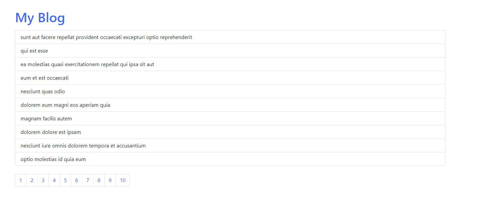

# React JSON Placeholder API with Pagination

## Overview

This project aims to implement pagination using an API. It allows users to retrieve data in smaller chunks, improving performance and user experience. 

## Features

- Pagination with page buttons
- Displaying a specific number of items per page
- Retrieving data from an API endpoint

## Installation

1. Clone the repository: `git clone https://github.com/username/repository.git`
2. Navigate to the project directory: `cd repository`
3. Install dependencies: `npm install`
4. Run project: `npm run dev`

## License

This project is licensed under the [MIT License](LICENSE).
